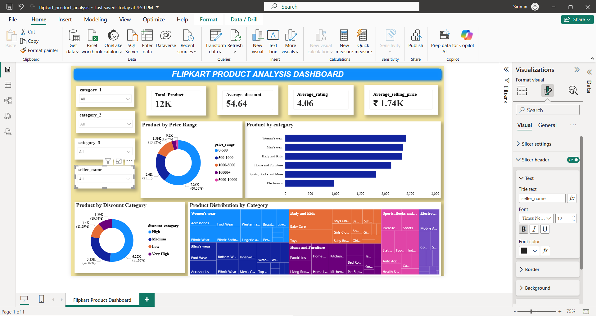

# 🛒 Flipkart Product Analysis Dashboard

## 📌 Project Overview
This project analyzes Flipkart product data using Power BI, SQL, and Python to uncover insights related to pricing, discounts, ratings, sellers, and product categories.

The dashboard provides an interactive view of product performance and helps identify trends across different categories.

---

## 📊 Dashboard Preview

---

## 🎯 Business Objectives

- Analyze product distribution across categories
- Study discount patterns and pricing trends
- Identify highly rated products and sellers
- Compare product counts across categories
- Explore customer-focused pricing insights

---

## 📈 Key KPIs

| KPI | Value |
|------|------|
| Total Products | 12K |
| Average Discount | 54.64% |
| Average Rating | 4.06 |
| Average Selling Price | ₹1.74K |

---

## 📊 Dashboard Visualizations

### 1. Product by Price Range
- Distribution of products across different price segments.

### 2. Product by Category
- Category-wise product count comparison.

### 3. Product by Discount Category
- High, Medium, Low and Very High discount analysis.

### 4. Product Distribution by Category (Treemap)
- Visual representation of category hierarchy and product distribution.

### 5. Interactive Slicers
- Category 1
- Category 2
- Category 3
- Seller Name

---

## 🛠️ Tools & Technologies

- Power BI
- SQL
- Python
- Pandas
- VSCode
- CSV Dataset
- GitHub

---

## 📂 Project Structure

flipkart-product-analysis/
│
├── flipkart.pbix
├── dataset.csv
├── dashboard.jpg
├── jupyter.ipynb
├── flipkart_queries.ipynb
└── README.md

---

## 🚀 Skills Demonstrated

- Data Cleaning
- Data Transformation
- Exploratory Data Analysis (EDA)
- SQL Querying
- Data Visualization
- Dashboard Design
- Business Insight Generation

---

## 👩‍💻 Author

**Riya Saraswati**

BCA Student | Aspiring Data Analyst | Power BI Enthusiast

